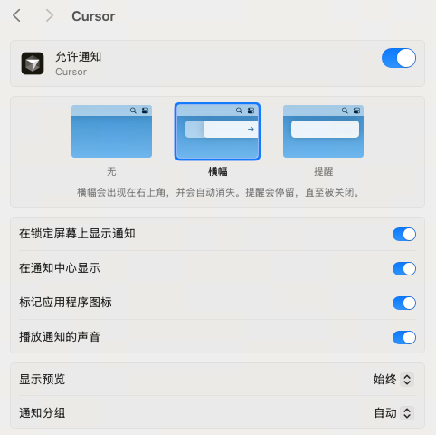
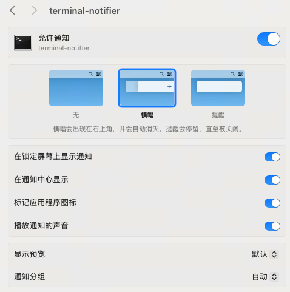

# cursor-notifier
这是一个基于 Cursor Hook 和 terminal-notifier 的自动化工具，能在 AI 任务完成时自动发送 macOS 系统通知，帮助开发者在等待期间安心处理其他事务，任务结束后即时回归，从而提升研发效能。

> **背景**：在日常开发中，我们经常需要等待 AI 执行较长时间的任务（如运行测试、重构代码、分析文档等）。这段"等待时间"如果不加管理，很容易导致注意力的流失和上下文切换的成本增加。

为了解决这个问题，优化开发体验，我配置了一套**自动通知机制**。

**核心功能**：当 Cursor 中的 AI 任务完成时，自动发送系统通知，提醒开发者回归任务。无需人工干预，无需手动输入命令。

## 1. 方案优势

- **零侵入性**：不需要在每次对话中手动添加通知命令，配置一次，永久生效。
- **自动化**：基于 Cursor 的 `hooks` 机制，精准捕获 AI 回复完成的事件。
- **专注力保护**：在等待 AI 处理时，可以放心地处理其他事务（如查看文档、回复消息），任务完成后即时召回，减少无效等待时间。
- **效能提升**：实测表明，该机制能有效减少因"忘记切回 IDE"而产生的时间浪费，保持心流状态。

## 2. 配置步骤（macOS）

本方案依赖 `terminal-notifier` 工具和 Cursor 的 Hooks 功能。

### 第一步：安装通知工具

使用 Homebrew 安装 `terminal-notifier`：

```bash
brew install terminal-notifier
```

### 第二步：创建通知脚本

脚本已开源，请直接从 GitHub 仓库获取最新版本：

1.  访问仓库：[cursor-notifier](https://github.com/wa815774/cursor-notifier)
2.  将仓库中的 `notify-hook.sh` 和 `hooks.json` 文件复制粘贴到 `~/.cursor/` 目录下。

> **注意**：脚本中的 `terminal-notifier` 路径 `/opt/homebrew/bin/terminal-notifier` 请根据实际安装位置调整（通过 `which terminal-notifier` 查看）。

**赋予脚本执行权限：**

```bash
chmod +x ~/.cursor/notify-hook.sh
```

### 第三步：配置 Cursor Hooks

创建或修改配置文件 `~/.cursor/hooks.json`：

```bash
vim ~/.cursor/hooks.json
```

写入以下配置，注册 `afterAgentResponse` 事件：

```json
{
  "version": 1,
  "hooks": {
    "afterAgentResponse": [
      {
        "command": "./notify-hook.sh"
      }
    ]
  }
}
```

### 第四步：系统通知设置（关键）

为了确保通知能正常弹出且伴有提示音，需要在 macOS 的"系统设置"中进行调整。

1.  打开 **系统设置** -> **通知**。
2.  找到 **Cursor** 和 **terminal-notifier**。
3.  确保两者的"允许通知"开关均已**打开**。
4.  建议开启"播放通知的声音"和"横幅"样式。

**设置参考图：**





## 3. 使用效果

配置完成后，正常使用 Cursor 进行 AI 对话即可。

1.  在 Chat 面板中向 AI 提问或布置任务。
2.  切换到其他窗口处理工作。
3.  当 AI 输出完毕（generation 完成），系统会自动弹出通知，点击通知即可快速切回当前项目。

---

通过这个简单的自动化配置，我们可以更从容地管理碎片化时间，提升整体研发效率。
